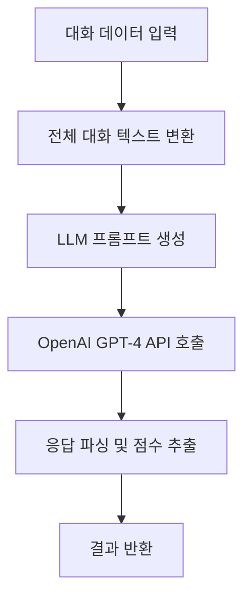

# Callytics - LLM 기반 상담 품질 정성 평가 지표

## 🎯 개요

Callytics 2단계 기능으로 **LLM(Large Language Model)을 활용한 정성적 상담 품질 평가 지표 2종**을 추가했습니다. 기존의 정량적 지표로는 파악하기 어려운 **문제 해결 능력**과 **대화 매너**를 AI가 분석하여 평가합니다.

## 📊 새로운 LLM 기반 지표

### 6. 문제 해결 제안 점수 (suggestions)
- **정의**: 얼마나 효율적인 제안으로 문제를 해결했는지를 단계별로 점수화
- **데이터 타입**: `float` (1.0, 0.6, 0.2, 0.0)
- **평가 기준**:
  - `1.0점`: 최초로 제시한 아이디어로 문제가 해결됨
  - `0.6점`: 첫 번째 아이디어는 실패했지만, 두 번째로 제시한 아이디어로 해결됨
  - `0.2점`: 세 번 이상의 아이디어를 제시하여 문제를 해결함
  - `0.0점`: 대화가 끝날 때까지 문제가 해결되지 못함

### 7. 대화 가로채기 횟수 (interruption_count)
- **정의**: 상담사가 고객의 말을 중간에 끊은 횟수
- **데이터 타입**: `integer`
- **판단 로직**: 
  1. 발화 순서대로 i-1번째 발화가 '고객', i번째 발화가 '상담사'인 경우를 찾음
  2. 상담사 발화 `start_time[i] < 고객 발화 end_time[i-1]` 조건을 만족하는 경우를 '가로채기'로 간주
  3. 총 횟수를 합산

## 🔧 기술 구현

### LLM 기반 분석 플로우


### 핵심 구현 클래스

#### CommunicationQualityAnalyzer 확장
```python
# 새로운 필드 추가
@dataclass
class CommunicationQualityResult:
    # 기존 필드들...
    suggestions: Optional[float] = None               # 문제 해결 제안 점수
    interruption_count: Optional[int] = None          # 대화 가로채기 횟수

# 새로운 분석 메서드
async def _calculate_suggestions_score(self, utterances_data) -> Optional[float]:
    """LLM 기반 문제 해결 제안 점수 계산"""
    
def _calculate_interruption_count(self, utterances_data) -> Optional[int]:
    """규칙 기반 대화 가로채기 횟수 계산"""
```

### LLM 프롬프트 예시

#### 문제 해결 제안 점수 프롬프트
```
당신은 상담 품질 평가 전문가입니다. 
상담 대화를 분석하고, 문제 해결 과정에 따라 아래 규칙에 맞춰 점수를 부여해주세요.

점수 기준:
- 1.0점: 최초로 제시한 아이디어로 문제가 해결됨
- 0.6점: 첫 번째 아이디어는 실패했지만, 두 번째로 제시한 아이디어로 해결됨  
- 0.2점: 세 번 이상의 아이디어를 제시하여 문제를 해결함
- 0.0점: 대화가 끝날 때까지 문제가 해결되지 못함

반드시 '1.0', '0.6', '0.2', '0.0' 중 하나의 숫자로만 답변해주세요.
```

## 🗄️ 데이터베이스 스키마

### communication_quality 테이블 확장
```sql
-- 새로운 LLM 기반 정성 평가 지표 2종
suggestions REAL,                               -- 문제 해결 제안 점수 (1.0, 0.6, 0.2, 0.0)
interruption_count INTEGER,                     -- 대화 가로채기 횟수

-- 성능 최적화 인덱스
CREATE INDEX IF NOT EXISTS idx_communication_quality_suggestions ON communication_quality(suggestions);
CREATE INDEX IF NOT EXISTS idx_communication_quality_interruption_count ON communication_quality(interruption_count);
```

### 통합 뷰 업데이트
```sql
-- v_integrated_consultation_analysis 뷰에 새 지표 추가
SELECT 
    -- 기존 컬럼들...
    cq.suggestions,
    cq.interruption_count,
    ap.created_at
FROM audio_properties ap
LEFT JOIN consultation_analysis ca ON ap.id = ca.audio_properties_id
LEFT JOIN communication_quality cq ON ap.id = cq.audio_properties_id
```

## 🧪 테스트 및 검증

### 테스트 시나리오

#### 시나리오 1: 첫 번째 제안 성공
```python
scenario1_data = [
    {"speaker": "고객", "text": "요금 관련해서 문의드리고 싶습니다."},
    {"speaker": "상담사", "text": "요금 내역을 확인해드리겠습니다. 데이터 사용량을 확인해보니 많이 사용하셨네요."},
    {"speaker": "고객", "text": "아 그렇군요. 감사합니다."}
]
# 예상 결과: suggestions=1.0, interruption_count=0
```

#### 시나리오 2: 가로채기 발생
```python
scenario2_data = [
    {"speaker": "고객", "text": "인터넷이 자꾸 끊어져서...", "start_time": 0.0, "end_time": 4.0},
    {"speaker": "상담사", "text": "네, 인터넷 문제시죠.", "start_time": 3.5, "end_time": 5.0},  # 가로채기
]
# 예상 결과: interruption_count=1
```

### 테스트 실행
```bash
# 간단 테스트 (의존성 없음)
python simple_llm_qualitative_test.py

# 통합 테스트 (실제 LLM API 필요)
python test_llm_qualitative_metrics.py
```

## 📈 분석 결과 예시

### 리포트 출력 예시
```
🤖 LLM 기반 정성 평가 지표:
  6. 문제 해결 제안 점수:    1.0
     → 최초 제안으로 문제 해결
  7. 대화 가로채기 횟수:     0회
     → 가로채기 없음 (양호)
```

### DataFrame 결과
```python
df = analyzer.export_results_to_dataframe(result)
print(df[['suggestions', 'interruption_count']])

#    suggestions  interruption_count
# 0         1.0                   0
```

## ⚙️ 설정 및 사용법

### 1. 환경 설정
```bash
# OpenAI API 키 설정 (.env 파일)
OPENAI_API_KEY=your_openai_api_key_here
```

### 2. 기본 사용법
```python
from src.text.communication_quality_analyzer import CommunicationQualityAnalyzer

# 분석기 초기화 (LLM 핸들러 자동 초기화)
analyzer = CommunicationQualityAnalyzer()

# 상담 데이터 분석
utterances_data = [...]  # 화자 분리된 발화 데이터
result = analyzer.analyze_communication_quality(utterances_data)

# 결과 확인
print(f"문제 해결 제안 점수: {result.suggestions}")
print(f"대화 가로채기 횟수: {result.interruption_count}회")
```

### 3. 통합 분석기 사용
```python
from src.integrated_analyzer import IntegratedAnalyzer

analyzer = IntegratedAnalyzer()
result = analyzer.analyze_consultation("audio/sample.wav")

# LLM 기반 지표 확인
quality = result['communication_quality']
print(f"제안 점수: {quality['suggestions']}")
print(f"가로채기: {quality['interruption_count']}회")
```

## 🚀 성능 및 최적화

### LLM API 호출 최적화
- **재시도 메커니즘**: 최대 3회 재시도
- **타임아웃 설정**: 30초 제한
- **폴백 처리**: API 실패 시 None 반환
- **비용 최적화**: 최소 토큰 사용 (max_tokens=50)

### 처리 성능
- **가로채기 계산**: O(n) 시간 복잡도
- **LLM 분석**: 평균 2-3초 (API 호출 포함)
- **메모리 사용량**: 최소화된 텍스트 처리

## 🔍 품질 평가 기준

### 문제 해결 제안 점수 해석
- **1.0점 (우수)**: 효율적인 문제 해결, 고객 만족도 높음
- **0.6점 (보통)**: 적절한 문제 해결, 개선 여지 있음
- **0.2점 (미흡)**: 비효율적 해결 과정, 교육 필요
- **0.0점 (불량)**: 문제 해결 실패, 즉시 개선 필요

### 대화 가로채기 횟수 해석
- **0회 (양호)**: 고객 중심 대화, 매너 우수
- **1-2회 (보통)**: 일반적 수준, 주의 필요
- **3회 이상 (개선 필요)**: 대화 매너 교육 필요

## 🎯 활용 방안

### 1. 상담사 교육
- 문제 해결 능력 향상 프로그램
- 대화 매너 개선 교육
- 개인별 맞춤 피드백 제공

### 2. 성과 평가
- 정량적 지표와 정성적 지표 종합 평가
- 월별/분기별 성과 트렌드 분석
- 팀별 벤치마킹

### 3. 품질 관리
- 실시간 상담 품질 모니터링
- 문제 상담 자동 감지
- 고객 만족도 예측

## 🔧 문제 해결

### 자주 발생하는 문제

#### LLM API 오류
```python
# 해결 방법 1: API 키 확인
import os
print(os.getenv("OPENAI_API_KEY"))

# 해결 방법 2: 폴백 모드 사용
analyzer = CommunicationQualityAnalyzer()
if analyzer.llm_handler is None:
    print("LLM 기능 비활성화, 정량 지표만 사용")
```

#### 시간 정보 누락
```python
# 해결 방법: 시간 정보 검증
for utterance in utterances_data:
    if 'start_time' not in utterance or 'end_time' not in utterance:
        print(f"시간 정보 누락: {utterance}")
```

## 📝 업데이트 로그

### v2.0.0 (2024-12-19)
- ✅ LLM 기반 문제 해결 제안 점수 추가
- ✅ 규칙 기반 대화 가로채기 횟수 추가
- ✅ 데이터베이스 스키마 확장
- ✅ 통합 분석기 업데이트
- ✅ 테스트 케이스 구현
- ✅ 성능 최적화 및 오류 처리

### 기존 기능 (v1.0.0)
- 6가지 정성적 품질 지표
- 5가지 정량적 분석 지표
- 데이터베이스 통합
- 리포팅 기능

## 🤝 기여 및 지원

### 기여 방법
1. 새로운 LLM 프롬프트 개선
2. 추가 정성 평가 지표 제안
3. 성능 최적화 아이디어
4. 버그 리포트 및 수정

### 지원
- 이슈 트래킹: GitHub Issues
- 문서: README 파일들
- 테스트: `simple_llm_qualitative_test.py`

---

**Callytics v2.0** - LLM 기반 상담 품질 정성 평가로 더욱 정확하고 포괄적인 분석을 제공합니다! 🚀 