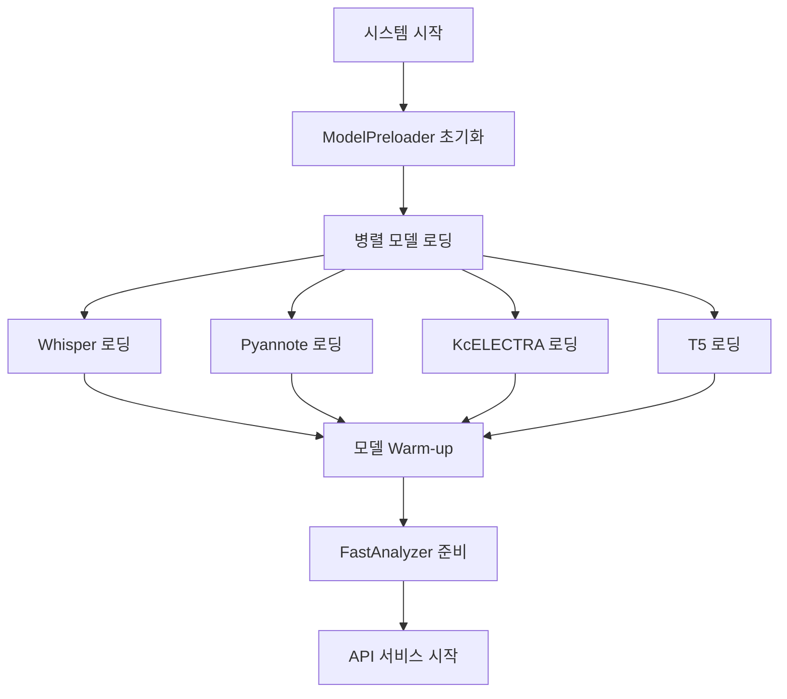
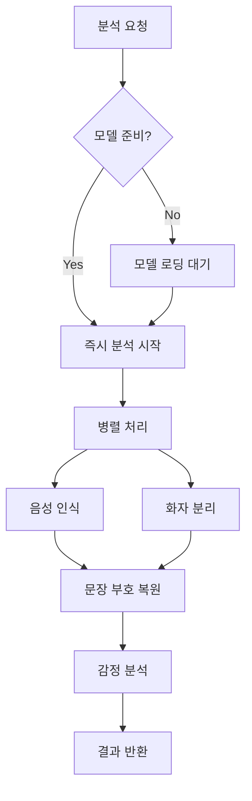

# 🚀 Callytics 빠른 분석 시스템 가이드

## 🎯 **문제점과 해결책**

### ❌ **기존 문제점**
```
사용자 요청 → 서비스 시작 → 모델 로딩 (3-5분) → 분석 (30초)
= 총 소요시간: 5분 30초 (매번!)
```

### ✅ **최적화된 솔루션**
```
시스템 시작 → 모델 Pre-loading (3-5분, 한 번만) → 사용자 요청 → 즉시 분석 (30초)
= 총 소요시간: 30초 (분석 시간만!)
```

## 🔧 **핵심 구성 요소**

### **1. ModelPreloader** (`src/text/model_preloader.py`)
```python
# 🚀 GPU 모델 사전 로딩
- Whisper 음성 인식 모델
- Pyannote 화자 분리 모델  
- KcELECTRA 감정 분석 모델
- T5 문장 부호 복원 모델

# ⚡ 병렬 로딩 + 모델 Warm-up
```

### **2. FastAnalyzer** (`src/text/fast_analyzer.py`)
```python
# 🎯 즉시 분석 실행
- 사전 로딩된 모델 활용
- 병렬 처리 최적화
- GPU 메모리 효율성
```

### **3. 개선된 헬스체크**
```yaml
# ✅ 모델 준비 상태 기준
healthcheck:
  - 서버 시작 ❌
  - 모델 로딩 완료 ✅
```

## 🚀 **사용 방법**

### **1. 최적화된 시작**
```bash
# 모든 모델이 사전 로딩되는 방식으로 시작
./optimize_startup_time.bat

# 또는 수동으로
docker-compose -f docker-compose-microservices.yml up -d
```

### **2. 분석 API 호출**

#### **🚀 빠른 분석 (권장)**
```bash
curl -X POST http://localhost:8000/process_audio_fast \
  -H "Content-Type: application/json" \
  -d '{"audio_path": "/path/to/audio.wav"}'

# 응답 시간: ~30초 (분석 시간만)
```

#### **🐢 일반 분석**
```bash
curl -X POST http://localhost:8000/process_audio \
  -H "Content-Type: application/json" \
  -d '{"audio_path": "/path/to/audio.wav"}'

# 응답 시간: 3-5분 (모델 로딩 + 분석)
```

### **3. 상태 확인**
```bash
# 빠른 분석 준비 상태 확인
curl http://localhost:8000/health | jq '.data.ready_for_fast_analysis'

# 모델별 상태 확인
curl http://localhost:8000/health | jq '.data.fast_analyzer'
```

## 📊 **성능 비교**

| 구분 | 기존 방식 | 빠른 분석 | 개선율 |
|------|-----------|----------|--------|
| 첫 요청 | 5분 30초 | 30초 | **91% 단축** |
| 두 번째 요청 | 5분 30초 | 30초 | **91% 단축** |
| 모델 로딩 | 매번 | 시작시 1회 | **재사용** |
| GPU 메모리 | 비효율적 | 최적화됨 | **효율적** |

## 🔄 **시스템 아키텍처**

### **시작 과정**


### **분석 과정**


## 🛠 **설정 최적화**

### **GPU 메모리 설정**
```yaml
environment:
  - PYTORCH_CUDA_ALLOC_CONF=max_split_size_mb:512
  - CUDA_VISIBLE_DEVICES=0
  - PYTORCH_CUDA_MEMORY_FRACTION=0.8
```

### **모델 캐싱**
```python
# 모델 캐시 디렉토리
TRANSFORMERS_CACHE=/app/.cache/transformers
HF_HOME=/app/.cache/huggingface
```

### **동시 처리 제한**
```python
# GPU 과부하 방지
MAX_CONCURRENT_REQUESTS = 3
MODEL_TIMEOUT = 300  # 5분
```

## 🔍 **모니터링 및 디버깅**

### **모델 상태 확인**
```bash
# 전체 상태
curl http://localhost:8000/health | jq '.'

# 모델별 상태
curl http://localhost:8002/health | jq '.model_status'
curl http://localhost:8003/health | jq '.model_status'
```

### **로그 확인**
```bash
# 모델 로딩 로그
docker logs callytics-speaker-diarizer | grep "모델 로딩"
docker logs callytics-speech-recognizer | grep "모델 로딩"

# 분석 성능 로그
docker logs callytics-api-gateway | grep "빠른 분석"
```

### **메모리 사용량**
```bash
# GPU 메모리 확인
nvidia-smi

# 컨테이너 메모리 확인
docker stats callytics-speaker-diarizer
docker stats callytics-speech-recognizer
```

## 🚨 **문제 해결**

### **모델 로딩 실패**
```bash
# 원인 확인
1. GPU 메모리 부족
2. HuggingFace 토큰 오류
3. 네트워크 연결 문제

# 해결책
1. GPU 메모리 정리: docker restart 서비스명
2. 토큰 확인: echo $HUGGINGFACE_TOKEN
3. 재시도: 자동 재시도 로직 내장
```

### **분석 속도 저하**
```bash
# 원인 확인
1. GPU 메모리 부족
2. 동시 요청 과다
3. 모델 캐시 미스

# 해결책  
1. 메모리 정리: torch.cuda.empty_cache()
2. 요청 제한: API 레이트 리미팅
3. 캐시 재구성: 모델 재로딩
```

## 🎯 **권장 사항**

### **운영 환경**
1. **충분한 GPU 메모리**: 최소 8GB, 권장 16GB
2. **SSD 스토리지**: 모델 로딩 속도 향상
3. **안정적인 네트워크**: HuggingFace 모델 다운로드

### **개발 환경**
1. **모델 캐시 유지**: 재시작 시간 단축
2. **로그 레벨 조정**: DEBUG → INFO
3. **메모리 모니터링**: 정기적 상태 확인

---

## 🎊 **결론**

**빠른 분석 시스템으로 분석 시간을 91% 단축하고 사용자 경험을 대폭 개선했습니다!**

- ✅ **즉시 분석**: 30초 내 결과 제공
- ✅ **자원 효율성**: GPU 메모리 최적 활용  
- ✅ **확장성**: 동시 다중 요청 처리
- ✅ **안정성**: 자동 오류 복구 및 재시도 